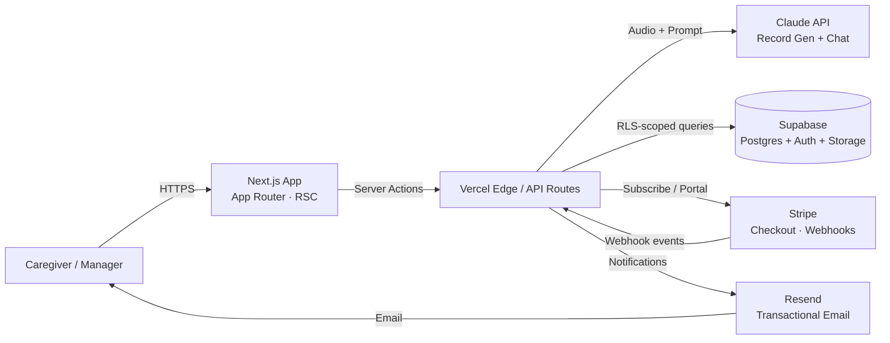

# Kaigo DX Assist

[](https://nextjs.org/)
[](https://www.typescriptlang.org/)
[](https://supabase.com/)
[](https://stripe.com/)
[](https://www.anthropic.com/)
[](https://vercel.com/)
[](#license)

> AI-assisted care record automation for Japanese long-term care providers — record once, document everything.

**Live:** [https://kaigo-dx.vercel.app](https://kaigo-dx.vercel.app)

## Overview

Kaigo DX Assist removes the daily paperwork burden from caregiving staff. Workers record short voice notes during or after each visit; Claude transforms them into structured care records that comply with Japanese long-term-care reporting conventions. Managers see real-time dashboards of completion rates and resident status, and a built-in support chatbot answers operational questions without raising a ticket. Subscription billing is handled end-to-end through Stripe.

## Key Features

- 🎙️ **Voice recording** — capture care notes in the field directly from any device's microphone.
- 🤖 **AI record generation** — Claude turns spoken notes into structured, audit-ready care records.
- 📊 **Dashboard** — live view of staff completion rates, resident events, and exception alerts.
- 💳 **Stripe billing** — self-serve subscription, plan switching, invoicing, and webhooks.
- 💬 **CS Chat Bot** — Claude-powered support assistant for in-product help and onboarding.

## Tech Stack

| Layer            | Technology                                                |
| ---------------- | --------------------------------------------------------- |
| Framework        | Next.js 16 (App Router, Server Actions, React 19)         |
| Language         | TypeScript 5                                              |
| Styling          | Tailwind CSS v4                                           |
| AI               | Claude API via `@anthropic-ai/sdk` (record gen + chatbot) |
| Database         | Supabase Postgres with Row Level Security                 |
| Auth             | Supabase Auth (email + magic link)                        |
| Storage          | Supabase Storage (audio blobs)                            |
| Payments         | Stripe Checkout + Customer Portal + Webhooks              |
| Email            | Resend (receipts, invites, alerts)                        |
| Testing          | Playwright (37 end-to-end tests)                          |
| Hosting          | Vercel                                                    |
| Observability    | Vercel Analytics + Logs                                   |

## Architecture



**Request flow — voice to record:**

1. Caregiver records audio in the browser → uploaded to Supabase Storage.
2. Server Action invokes Claude with the transcript and a structured-output prompt.
3. Generated record is persisted in Postgres under the worker's RLS-scoped tenant.
4. Manager dashboard subscribes to changes via Supabase Realtime.

## Environment Variables

| Variable                              | Required | Description                                                |
| ------------------------------------- | :------: | ---------------------------------------------------------- |
| `ANTHROPIC_API_KEY`                   |    ✅    | Claude API key — record generation and CS chatbot          |
| `NEXT_PUBLIC_SUPABASE_URL`            |    ✅    | Supabase project URL                                       |
| `NEXT_PUBLIC_SUPABASE_ANON_KEY`       |    ✅    | Supabase public anon key                                   |
| `SUPABASE_SERVICE_ROLE_KEY`           |    ✅    | Supabase service role key (server-only)                    |
| `STRIPE_SECRET_KEY`                   |    ✅    | Stripe secret key                                          |
| `STRIPE_WEBHOOK_SECRET`               |    ✅    | Signing secret for `/api/stripe/webhook`                   |
| `NEXT_PUBLIC_STRIPE_PUBLISHABLE_KEY`  |    ✅    | Stripe publishable key (safe for browser)                  |
| `STRIPE_PRICE_ID`                     |    ✅    | Default subscription price ID                              |
| `RESEND_API_KEY`                      |    ✅    | Resend API key for transactional email                     |
| `NEXT_PUBLIC_APP_URL`                 |    ✅    | Public base URL (e.g. `https://kaigo-dx.vercel.app`)       |

> ⚠️ Never commit `.env.local`. The Supabase service role key bypasses RLS and the Stripe secret key authorizes charges — keep both server-side only.

## Getting Started

### Prerequisites

- Node.js 20+
- npm 10+
- Supabase project
- Anthropic API key
- Stripe account (test mode is fine for local dev)
- Resend API key

### 1. Clone & install

```bash
git clone https://github.com/<your-org>/kaigo-dx.git
cd kaigo-dx
npm install
```

### 2. Configure environment

```bash
cp .env.example .env.local
# Fill in the values from the table above
```

### 3. Apply database schema

```bash
supabase db push
```

### 4. Forward Stripe webhooks (local dev)

```bash
stripe listen --forward-to localhost:3000/api/stripe/webhook
```

Copy the printed `whsec_...` value into `STRIPE_WEBHOOK_SECRET`.

### 5. Run the dev server

```bash
npm run dev
```

Open [http://localhost:3000](http://localhost:3000).

## Testing

End-to-end coverage is provided by Playwright with **37 tests** spanning auth, voice capture, AI record generation, dashboard rendering, Stripe checkout, and the CS chatbot.

```bash
# Install browsers (first run only)
npx playwright install

# Run the full suite
npm run test:e2e

# Run a single spec
npx playwright test tests/voice-record.spec.ts

# Open the HTML report
npx playwright show-report
```

CI runs the suite on every pull request via GitHub Actions; merges are blocked until all 37 tests pass.

## Deployment

1. Push to GitHub and import the repo in [Vercel](https://vercel.com/new).
2. Add every variable from the table above under **Settings → Environment Variables**.
3. In the Stripe dashboard, register the production webhook endpoint:
   `https://kaigo-dx.vercel.app/api/stripe/webhook`
4. Set `NEXT_PUBLIC_APP_URL` to the production domain.
5. Deploy.

## License

MIT — see [LICENSE](../LICENSE) for details.
